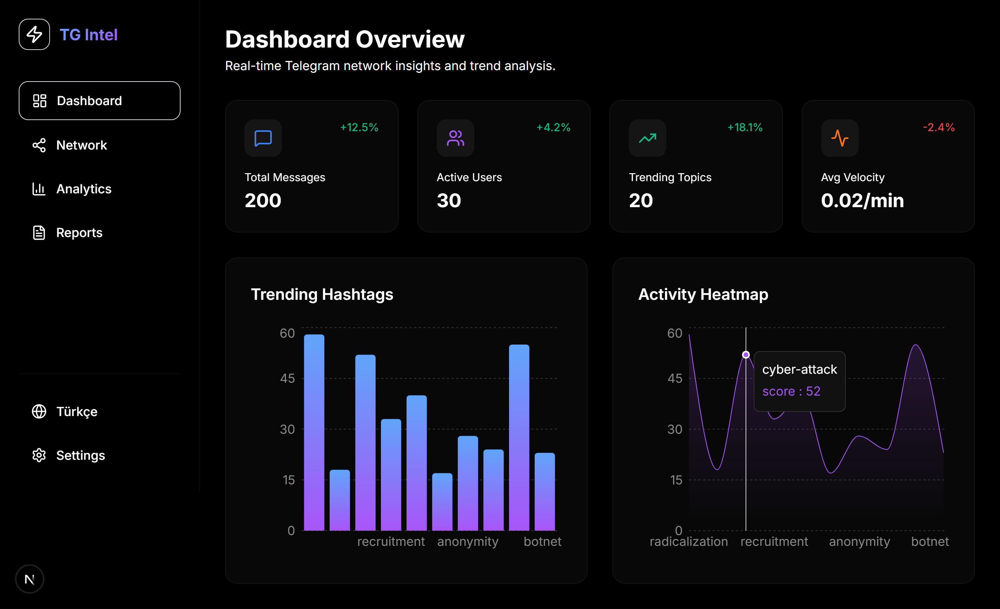
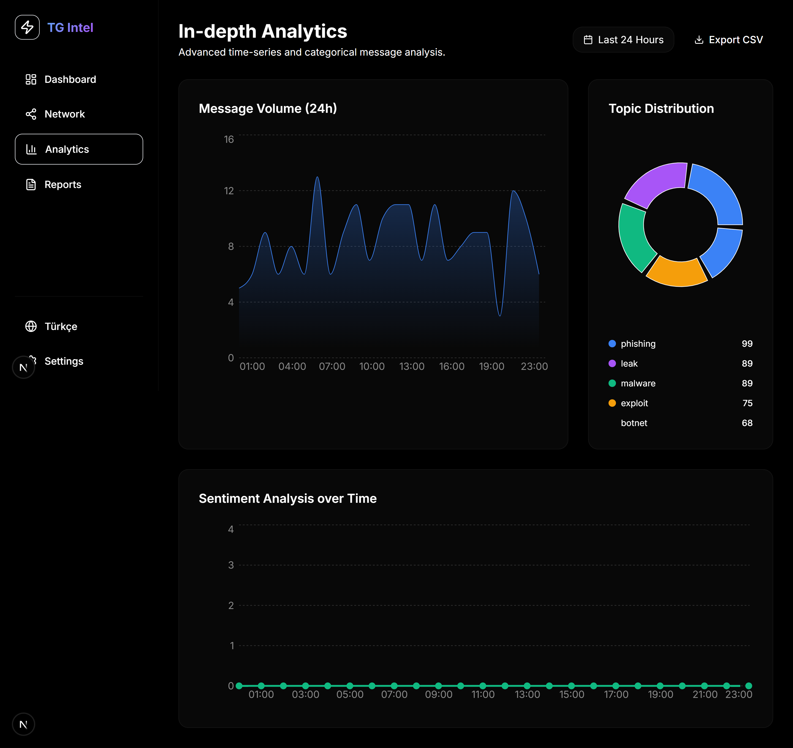
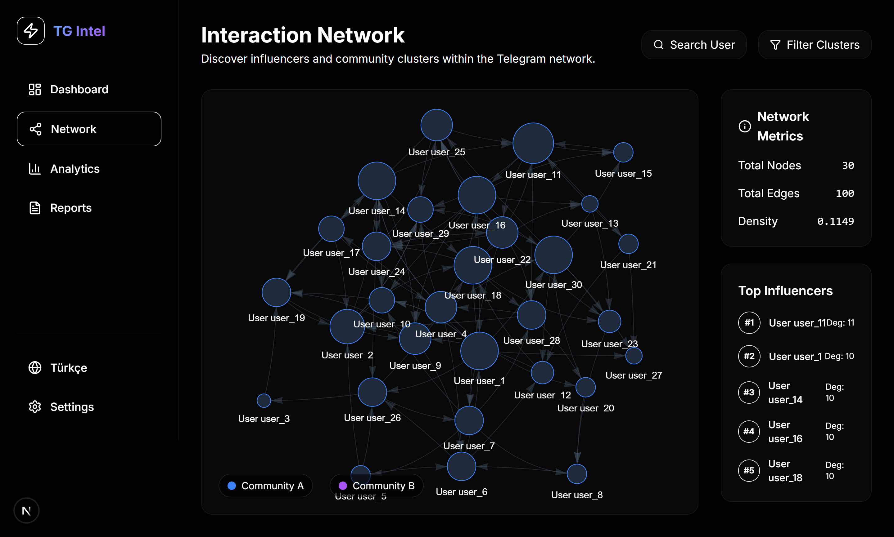
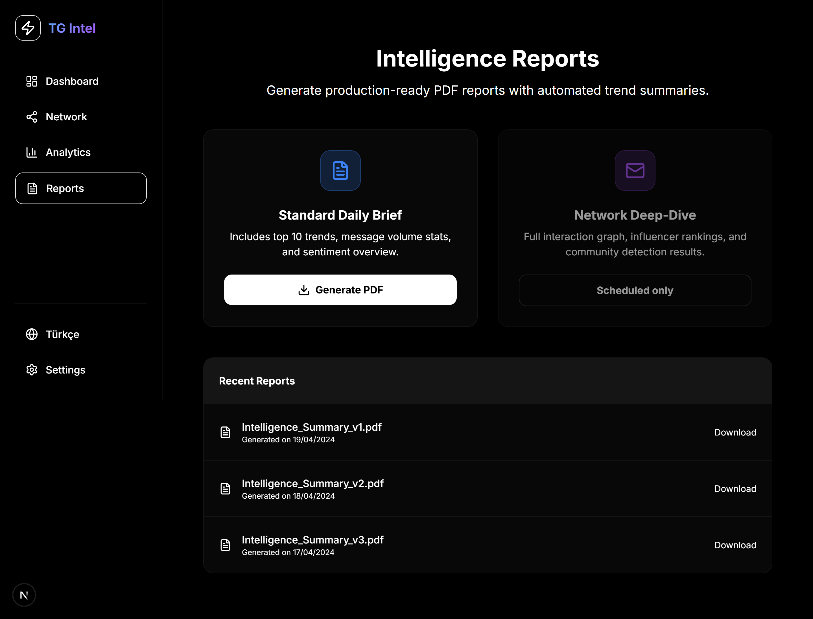
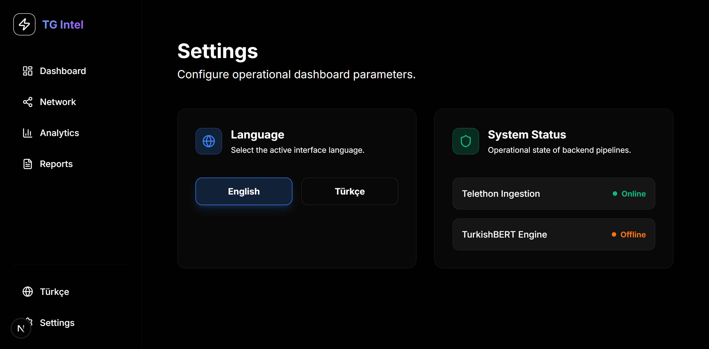

# ⚡ TG Intel: Telegram Trend & Network Intelligence Platform


**TG Intel** is a powerful intelligence and analysis platform designed to monitor, visualize, and analyze trends and interactions within the Telegram network. It leverages advanced graph theory and NLP to provide actionable insights for security researchers and data analysts.

---

## 🚀 Key Features

-   **📊 Real-time Analytics Dashboard:** Monitor network health, message velocity, and trending topics.
-   **🕸️ Interaction Network:** Visualize influencer nodes and community clusters with `vis-network`.
-   **🤖 Automated Data Ingestion:** High-speed Telegram data streaming using `Telethon`.
-   **🗄️ Enterprise Data Storage:** Robust management with `MSSQL` and `Prisma ORM`.
-   **📄 Intelligence Reports:** Automated PDF generation for trend summaries and deep-dives.
-   **🌍 Multi-language Support:** Seamlessly switch between English and Turkish interfaces.

---

## 🖼️ User Interface Showcase

### 🖥️ Dashboard Overview
Real-time monitoring of network stats, trending hashtags, and activity heatmaps.


### 📈 In-depth Analytics
Advanced time-series analysis and categorical distribution of message topics.


### 🌐 Interaction Network
Interactive graph visualization revealing influencer nodes and community clusters.


### 📄 Intelligence Reports
Production-ready PDF report generation with automated summaries.


### ⚙️ System Settings & Status
Localized interface control and real-time monitoring of backend pipelines.


---

## 🛠️ Technology Stack

| Layer | Technology |
| :--- | :--- |
| **Frontend** | Next.js 15 (App Router), React 19, Tailwind CSS |
| **Backend** | Python (Telethon), Next.js API Routes |
| **Database** | MSSQL Server 2022 |
| **ORM** | Prisma |
| **Visuals** | Recharts, Vis-network, Lucide Icons |
| **Analysis** | NetworkX, Scikit-learn, BERT |

---

## ⚙️ Installation & Setup

### 1. Prerequisites
-   [Node.js](https://nodejs.org/) (v18+)
-   [Python](https://www.python.org/) (v3.9+)
-   [MSSQL Server](https://www.microsoft.com/en-us/sql-server/)

### 2. Environment Configuration
Create a `.env` file in the root directory:
```env
# Database connection
DATABASE_URL="sqlserver://localhost:1433;database=TGIntel;user=SA;password=YourPassword123;encrypt=true;trustServerCertificate=true"

# Telegram API credentials
TELEGRAM_API_ID="your_api_id"
TELEGRAM_API_HASH="your_api_hash"
```

### 3. Local Development
```bash
# Install dependencies
npm install

# Initialize database
npx prisma generate
npx prisma db push

# Start the dashboard
npm run dev
```

### 4. Running Python Services
```bash
# Data ingestion
cd python-services/ingestion
python main.py

# Analysis engine
cd python-services/analysis
python main.py
```

---

## 📂 Project Structure

```text
├── python-services/   # Data ingestion & NLP engines
├── prisma/            # Database schema & seeds
├── public/            # Screenshots & static assets
├── src/
│   ├── app/           # App Router (Pages & API)
│   ├── components/    # UI components (Charts, Graphs)
│   └── lib/           # Shared logic & Prisma client
└── package.json       # Project dependencies
```

---

## 📄 License

Distributed under the MIT License.

---

<p align="center">
  Built with ⚡ for Telegram Intelligence
</p>
